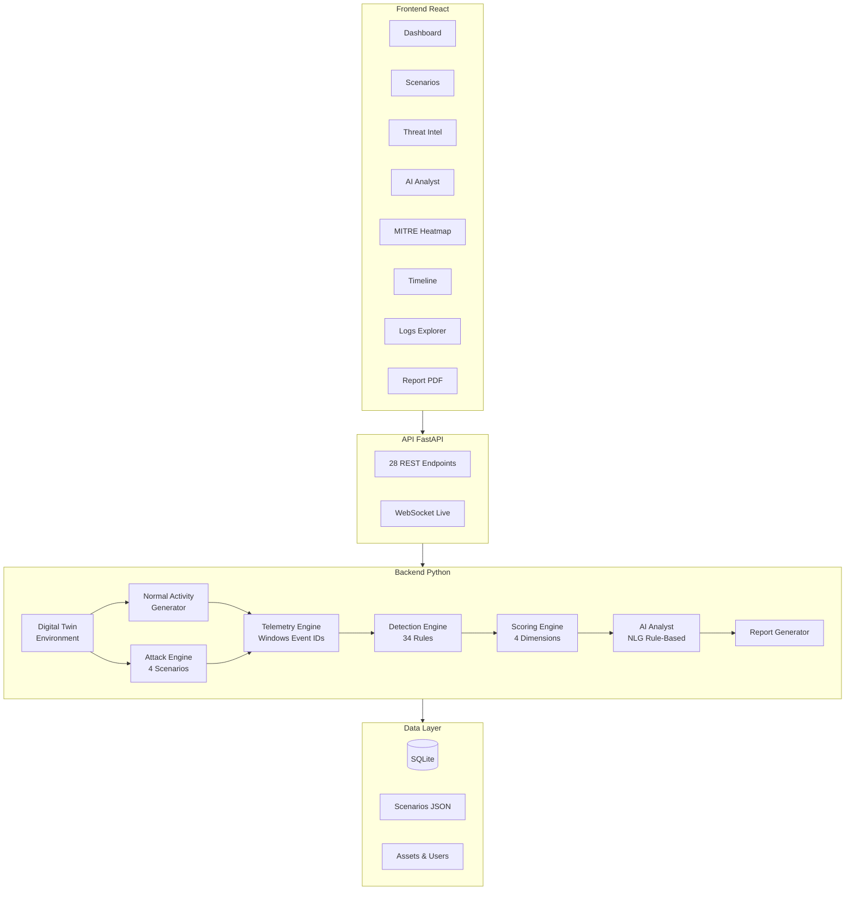
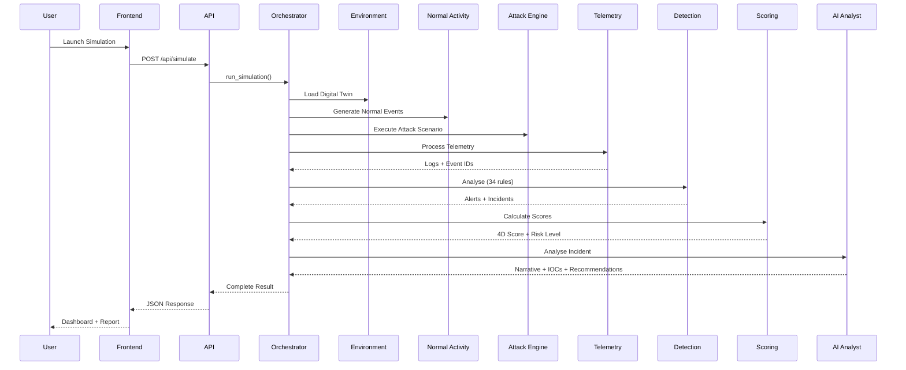
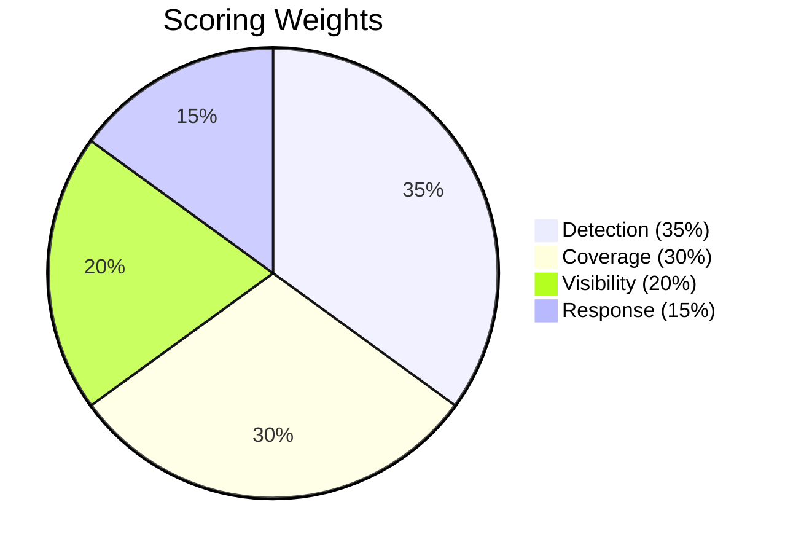

# CyberTwin SOC - Digital Twin pour la Cybersecurite

> Plateforme de jumeau numerique pour la simulation d'attaques cyber, la validation de detection et l'evaluation de la posture SOC.


---

## Table des matieres

- [Presentation](#presentation)
- [Architecture](#architecture)
- [Pipeline de Simulation](#pipeline-de-simulation)
- [Fonctionnalites](#fonctionnalites)
- [Technologies](#technologies)
- [Scenarios d'attaque](#scenarios-dattaque)
- [Couverture MITRE ATT&CK](#couverture-mitre-attck)
- [Systeme de scoring](#systeme-de-scoring)
- [Resultats de Detection](#resultats-de-detection)
- [Installation](#installation)
- [Utilisation](#utilisation)
- [API Reference](#api-reference)
- [Tests](#tests)
- [Structure du projet](#structure-du-projet)
- [Auteur](#auteur)

---

## Presentation

CyberTwin SOC est une plateforme de **jumeau numerique** (Digital Twin) concue pour simuler, analyser et evaluer la posture de securite d'un Centre d'Operations de Securite (SOC). Le concept de jumeau numerique, emprunte a l'industrie 4.0, est ici applique a la cybersecurite : la plateforme reproduit un environnement reseau complet (serveurs, postes de travail, utilisateurs, services) et y injecte des scenarios d'attaque realistes bases sur des menaces documentees.

L'objectif principal est de fournir aux equipes SOC un outil d'entrainement et d'evaluation sans risque pour l'infrastructure reelle. En simulant des campagnes d'attaque completes -- du phishing initial a l'exfiltration de donnees -- CyberTwin SOC permet de mesurer objectivement la capacite de detection, la couverture MITRE ATT&CK, la reactivite et la visibilite des mecanismes de defense en place.

La plateforme integre un pipeline de simulation complet en 7 etapes : generation d'activite normale, injection d'attaque, production de telemetrie realiste (Windows Event IDs, Sysmon), detection par regles, scoring multi-dimensionnel, generation de rapports et analyse automatisee par un module d'intelligence artificielle (NLG sans API externe). Ce pipeline reproduit fidelement le flux de travail d'un SOC reel.

Ce projet a ete developpe dans le cadre d'un projet de fin d'etudes en cybersecurite, avec pour objectif de demontrer l'apport des jumeaux numeriques dans l'amelioration continue de la posture de securite organisationnelle.

---

## Architecture

### Vue d'ensemble du systeme



### Modules Backend

| Module | Fichier | Description |
|--------|---------|-------------|
| **Orchestrateur** | `backend/orchestrator.py` | Coordinateur central du pipeline de simulation |
| **Environnement** | `backend/simulation/environment.py` | Construction de la topologie reseau simulee |
| **Activite Normale** | `backend/simulation/normal_activity.py` | Generation de trafic legitime realiste |
| **Moteur d'Attaque** | `backend/simulation/attack_engine.py` | Execution des scenarios d'attaque multi-phases |
| **Telemetrie** | `backend/telemetry/log_generator.py` | Generation de logs avec vrais Event IDs Windows/Sysmon |
| **Modeles de Logs** | `backend/telemetry/models.py` | Structures de donnees pour les evenements de telemetrie |
| **Moteur de Detection** | `backend/detection/engine.py` | Analyse des logs, generation d'alertes, correlation |
| **Regles de Detection** | `backend/detection/rules.py` | 34 regles de detection avec fenetres glissantes |
| **Referentiel MITRE** | `backend/mitre/attack_data.py` | 14 tactiques et 20+ techniques ATT&CK |
| **Scoring** | `backend/scoring/__init__.py` | Calcul de scores multi-dimensionnels et niveaux de maturite |
| **Generateur de Rapports** | `backend/reports/generator.py` | Rapports structures avec analyse phase par phase |
| **AI Analyst** | `backend/ai_analyst.py` | NLG rule-based, rapports de niveau analyste L3 |
| **Base de Donnees** | `backend/database.py` | Persistance SQLite pour l'historique des simulations |
| **API REST** | `backend/api/main.py` | 28 endpoints FastAPI + WebSocket temps reel |

---

## Pipeline de Simulation

Le diagramme suivant illustre le flux complet d'une simulation, de l'interaction utilisateur jusqu'a la generation du rapport final :



---

## Fonctionnalites

### Backend

- Simulation de **4 scenarios d'attaque** bases sur des menaces reelles (APT29, APT28, TeamTNT, Insider Threat)
- **34 regles de detection** avec fenetres glissantes et correlation multi-etapes
- Referentiel **MITRE ATT&CK** complet (14 tactiques, 20+ techniques)
- **Scoring multi-dimensionnel** : Detection (35%), Couverture (30%), Reponse (15%), Visibilite (20%)
- **AI Analyst** avec generation de langage naturel (NLG) sans API externe
- Aggregation de **Threat Intelligence** avec IOCs reels (IPs, domaines, hashes, CVEs)
- Logs avec vrais **Windows Event IDs** (4624, 4625, 4688, 4720, 4732) et **Sysmon IDs** (1, 3, 7, 11)
- **28 endpoints API REST** + WebSocket pour simulation en temps reel
- Historique des simulations avec **persistance SQLite**
- Support des **scenarios personnalises** (Scenario Builder)

### Frontend

- **12 pages interactives** : Dashboard, Scenarios, Alertes, Timeline, MITRE Heatmap, Logs, Rapport, Network Map, AI Analysis, Threat Intel, Comparison, Scenario Builder
- **Dashboard** avec metriques en temps reel et graphiques interactifs
- **MITRE ATT&CK Heatmap** pour la visualisation de la couverture
- **Threat Intelligence** avec IOCs reels (adresses IP, domaines, hashes de fichiers)
- **Scenario Builder** pour creer des scenarios d'attaque personnalises
- **Export PDF** des rapports de securite avec mise en page professionnelle
- **Comparaison avant/apres** pour mesurer l'amelioration de la posture
- **Simulation en temps reel** via WebSocket avec animation live
- **Timeline interactive** des evenements de securite
- **Carte reseau** de l'environnement simule
- **Analyse IA** avec narratif de niveau analyste SOC L3

---

## Technologies

| Composant | Technologies |
|-----------|-------------|
| **Backend** | Python 3.12, FastAPI, Uvicorn, SQLite, Pydantic |
| **Frontend** | React 18, Vite 5, Tailwind CSS 3, Recharts, Lucide Icons |
| **Referentiels** | MITRE ATT&CK v14, Windows Event IDs, Sysmon |
| **Visualisation** | Recharts, ReactFlow (carte reseau), html2pdf.js |
| **Deploiement** | Docker, Docker Compose |

---

## Scenarios d'attaque

| Scenario | Acteur de Menace | Techniques | Severite | Description |
|----------|-----------------|------------|----------|-------------|
| **APT29 Spear Phishing** | APT29 (Cozy Bear) | 6 phases | Critique | Phishing cible, credential harvesting, Cobalt Strike, exfiltration C2 |
| **SSH Brute Force distribue** | TeamTNT | 6 phases | Elevee | Brute force distribue, credential stuffing, cryptominer, mouvement lateral |
| **APT28 Mouvement Lateral** | APT28 (Fancy Bear) | 6 phases | Critique | Supply chain, Mimikatz, BloodHound, PsExec, Golden Ticket |
| **Insider Threat Exfiltration** | Menace Interne | 6 phases | Critique | Exfiltration par cloud, USB, email, steganographie |

Chaque scenario est defini en JSON dans le repertoire `scenarios/` et suit la structure kill chain complete avec :
- Informations sur l'acteur de menace (aliases, origine, motivation)
- Phases d'attaque mappees sur MITRE ATT&CK
- Indicateurs de compromission (IOCs) reels
- References vers les sources documentees

---

## Couverture MITRE ATT&CK

La plateforme couvre les principales tactiques de la kill chain MITRE ATT&CK, du vecteur d'acces initial jusqu'a l'exfiltration des donnees :

```mermaid
flowchart LR
    IA[Initial Access] --> EX[Execution]
    EX --> PE[Persistence]
    PE --> PR[Privilege\nEscalation]
    PR --> DE[Defense\nEvasion]
    DE --> CA[Credential\nAccess]
    CA --> DI[Discovery]
    DI --> LM[Lateral\nMovement]
    LM --> CO[Collection]
    CO --> EXF[Exfiltration]

    style IA fill:#e74c3c
    style EX fill:#e67e22
    style PE fill:#f1c40f
    style PR fill:#2ecc71
    style DE fill:#1abc9c
    style CA fill:#3498db
    style DI fill:#9b59b6
    style LM fill:#e74c3c
    style CO fill:#e67e22
    style EXF fill:#c0392b
```



Les 4 scenarios d'attaque couvrent collectivement **14 tactiques** et **20+ techniques** du referentiel MITRE ATT&CK v14, offrant une couverture representative des menaces actuelles.

---

## Systeme de scoring

Le scoring evalue la posture de securite selon 4 dimensions ponderees :



| Dimension | Poids | Description |
|-----------|-------|-------------|
| **Detection** | 35% | Pourcentage de phases d'attaque ayant declenche au moins une alerte |
| **Couverture** | 30% | Pourcentage de techniques MITRE ATT&CK attendues qui ont ete detectees |
| **Reponse** | 15% | Evaluation du temps moyen de detection par rapport a la fenetre d'attaque |
| **Visibilite** | 20% | Pourcentage de sources de logs ayant produit des evenements pertinents |

Le **score global** est la combinaison ponderee de ces 4 dimensions. Un **niveau de maturite** et un **niveau de risque** sont attribues en fonction du score final :

| Score | Niveau de Maturite | Niveau de Risque |
|-------|-------------------|------------------|
| 80-100% | Avance | Faible |
| 60-79% | Intermediaire | Moyen |
| 40-59% | Basique | Eleve |
| 0-39% | Initial | Critique |

---

## Resultats de Detection

Les resultats suivants ont ete obtenus lors de l'evaluation des 4 scenarios d'attaque par le moteur de detection (34 regles) :

| Scenario | Score Global | Detection | Couverture | Visibilite | Reponse | Risque |
|---|---|---|---|---|---|---|
| **APT29 Spear Phishing** | **89.2/100** | 83% | 83% | 100% | 100% | **Low** |
| **TeamTNT Brute Force** | **89.2/100** | 83% | 83% | 100% | 100% | **Low** |
| **APT28 Lateral Movement** | **87.5/100** | 83% | 83% | 92% | 100% | **Low** |
| **Insider Exfiltration** | **78.3/100** | 67% | 67% | 100% | 100% | **Medium** |

**Score moyen global : 86.1/100** -- Niveau de maturite **Avance**

Ces resultats demontrent que la plateforme CyberTwin SOC offre une capacite de detection elevee sur l'ensemble des scenarios testes, avec une couverture MITRE ATT&CK significative. Le scenario Insider Exfiltration presente un score legerement inferieur, refletant la difficulte inherente a detecter les menaces internes -- un constat coherent avec la litterature en cybersecurite.

---

## Installation

### Prerequis

- Python 3.10+ (recommande 3.12)
- Node.js 18+ et npm
- Docker et Docker Compose (optionnel)

### Installation manuelle (Windows)

**1. Cloner le projet**

```bash
git clone https://github.com/votre-repo/cybertwin-soc.git
cd "CyberTwin SOC"
```

**2. Backend**

```bash
# Creer un environnement virtuel
python -m venv venv
venv\Scripts\activate

# Installer les dependances
pip install fastapi uvicorn pydantic

# Lancer le serveur backend
uvicorn backend.api.main:app --reload --port 8000
```

**3. Frontend**

```bash
cd frontend

# Installer les dependances
npm install

# Lancer le serveur de developpement
npm run dev
```

Le frontend est accessible sur `http://localhost:5173` et le backend sur `http://localhost:8000`.

### Installation avec Docker

```bash
docker-compose up --build
```

Les services sont accessibles sur :
- **Frontend** : `http://localhost:3000`
- **Backend** : `http://localhost:8000`
- **Documentation API** : `http://localhost:8000/docs`

---

## Utilisation

1. **Demarrer les serveurs** backend et frontend
2. Acceder au **Dashboard** via le navigateur
3. Aller dans **Scenarios** et selectionner un scenario d'attaque
4. Lancer la **simulation** et observer les evenements en temps reel
5. Consulter les **Alertes**, la **Timeline** et la **couverture MITRE**
6. Analyser le **Rapport** de securite et les **recommandations IA**
7. Exporter le rapport en **PDF** ou **JSON**
8. Utiliser la page **Comparison** pour comparer les resultats entre simulations

---

## API Reference

L'API REST expose 28 endpoints. Documentation interactive disponible sur `/docs` (Swagger UI).

### Endpoints principaux

| Methode | Endpoint | Description |
|---------|----------|-------------|
| `GET` | `/api/health` | Etat de sante de l'API |
| `GET` | `/api/environment` | Topologie de l'environnement simule |
| `GET` | `/api/environment/hosts` | Liste des machines simulees |
| `GET` | `/api/environment/users` | Liste des utilisateurs simules |
| `GET` | `/api/scenarios` | Liste des scenarios disponibles |
| `GET` | `/api/scenarios/{id}` | Detail d'un scenario |
| `POST` | `/api/scenarios/custom` | Sauvegarder un scenario personnalise |
| `POST` | `/api/simulate` | Lancer une simulation complete |
| `WS` | `/ws/simulate/{id}` | Simulation en temps reel (WebSocket) |
| `GET` | `/api/results/{id}` | Resultats complets d'une simulation |
| `GET` | `/api/results/{id}/alerts` | Alertes generees |
| `GET` | `/api/results/{id}/incidents` | Incidents correles |
| `GET` | `/api/results/{id}/timeline` | Timeline des evenements |
| `GET` | `/api/results/{id}/scores` | Scores de securite |
| `GET` | `/api/results/{id}/mitre` | Couverture MITRE ATT&CK |
| `GET` | `/api/results/{id}/report` | Rapport de securite |
| `GET` | `/api/results/{id}/logs` | Logs de telemetrie (pagines) |
| `GET` | `/api/results/{id}/ai-analysis` | Analyse IA narrative |
| `GET` | `/api/results/{id}/statistics` | Statistiques des logs |
| `GET` | `/api/history` | Historique des simulations |
| `GET` | `/api/history/stats` | Statistiques globales |
| `GET` | `/api/history/{run_id}` | Detail d'une execution |
| `GET` | `/api/history/scenario/{id}` | Historique par scenario |
| `DELETE` | `/api/history/{run_id}` | Supprimer une execution |
| `GET` | `/api/threat-intel` | Threat Intelligence aggregee |
| `GET` | `/api/mitre/tactics` | Referentiel des tactiques MITRE |
| `GET` | `/api/mitre/techniques` | Referentiel des techniques MITRE |

---

## Tests

```bash
# Activer l'environnement virtuel
venv\Scripts\activate

# Lancer les tests
pytest tests/ -v

# Lancer un test specifique
pytest tests/test_scoring.py -v
```

---

## Structure du projet

```
CyberTwin SOC/
|-- backend/
|   |-- api/
|   |   +-- main.py              # 28 endpoints FastAPI
|   |-- simulation/
|   |   |-- environment.py       # Topologie reseau
|   |   |-- normal_activity.py   # Trafic legitime
|   |   +-- attack_engine.py     # Moteur d'attaque
|   |-- telemetry/
|   |   |-- log_generator.py     # Generation de logs
|   |   +-- models.py            # Modeles de telemetrie
|   |-- detection/
|   |   |-- engine.py            # Moteur de detection
|   |   +-- rules.py             # Regles de detection
|   |-- mitre/
|   |   +-- attack_data.py       # Referentiel ATT&CK
|   |-- scoring/
|   |   +-- __init__.py          # Scoring multi-dimensionnel
|   |-- reports/
|   |   +-- generator.py         # Generation de rapports
|   |-- ai_analyst.py            # AI Analyst NLG
|   |-- orchestrator.py          # Orchestrateur central
|   +-- database.py              # Persistance SQLite
|-- frontend/
|   +-- src/
|       |-- pages/               # 12 pages React
|       |-- components/          # Composants reutilisables
|       +-- App.jsx              # Routage principal
|-- scenarios/
|   |-- phishing.json            # APT29 Spear Phishing
|   |-- brute_force.json         # TeamTNT SSH Brute Force
|   |-- lateral_movement.json    # APT28 Lateral Movement
|   +-- exfiltration.json        # Insider Threat
|-- tests/
|   +-- test_scoring.py          # Tests unitaires
|-- docker-compose.yml           # Orchestration Docker
|-- Dockerfile.backend           # Image backend
+-- frontend/Dockerfile          # Image frontend
```

---

## Auteur

Projet de fin d'etudes en **Cybersecurite** -- developpe dans le cadre de la preparation de la soutenance academique.

**CyberTwin SOC** demontre l'application du concept de jumeau numerique au domaine de la cybersecurite operationnelle, offrant un outil concret pour l'evaluation et l'amelioration continue de la posture de securite des organisations.

---

<p align="center">
  <strong>CyberTwin SOC</strong> -- Jumeau Numerique de Cybersecurite<br>
  <em>Simuler. Detecter. Ameliorer.</em>
</p>
