<div align="center">

# 🛡️ CyberTwin SOC

### Enterprise-grade Security Operations Center — open source, audited, production-ready

*A digital twin of a modern SOC. Emulates real adversary tradecraft, ingests OCSF telemetry, runs 46 detection rules + Sigma against the full MITRE ATT&CK matrix, drives a complete case-management workflow, and ships with AI analyst, ML anomaly detection, SOAR integration, Prometheus observability and Helm/Kubernetes deployment.*

> **v3.1.0 — Hardening release:** JWT revocation denylist + refresh token rotation · API modularised into 12 router files · nginx-unprivileged frontend · SQLAlchemy + Alembic PostgreSQL migration infra · scoped RBAC permissions on all ingestion endpoints · CI quality-gate job + Checkov IaC scan · 30+ AI analyst security tests.

[](https://github.com/omarbabba779xx/CyberTwin-SOC/actions)
[](#-quality--testing)
[](https://python.org)
[](https://react.dev)
[](#-security-posture)
[](LICENSE)
[](https://attack.mitre.org/)
[](https://schema.ocsf.io/)
[](deploy/helm)

[**Quick start**](#-quick-start) · [**Architecture**](#-architecture) · [**Features**](#-features) · [**Security**](#-security-posture) · [**Documentation**](#-documentation) · [**Roadmap**](#-roadmap)

</div>

---

## 📖 Table of contents

- [Why CyberTwin SOC?](#-why-cybertwin-soc)
- [Project at a glance](#-project-at-a-glance)
- [Architecture](#-architecture)
- [Features](#-features)
- [Quick start](#-quick-start)
- [Live telemetry ingestion (OCSF)](#-live-telemetry-ingestion-ocsf)
- [Detection Coverage Center](#-detection-coverage-center)
- [SOC workflow](#-soc-workflow)
- [Observability & metrics](#-observability--metrics)
- [Security posture](#-security-posture)
- [CI/CD pipeline](#-cicd-pipeline)
- [Production deployment](#-production-deployment)
- [Project structure](#-project-structure)
- [Quality & testing](#-quality--testing)
- [Documentation](#-documentation)
- [Roadmap](#-roadmap)
- [Contributing & license](#-contributing--license)

---

## 🎯 Why CyberTwin SOC?

> **The hardest problem in detection engineering is not writing rules — it's knowing which adversary behaviour you can actually catch, and proving it under pressure.**

CyberTwin SOC is **not** a SIEM, not a SOAR, and not yet another dashboard. It is a **digital twin of a Security Operations Center** that closes the four loops every mature SOC needs:

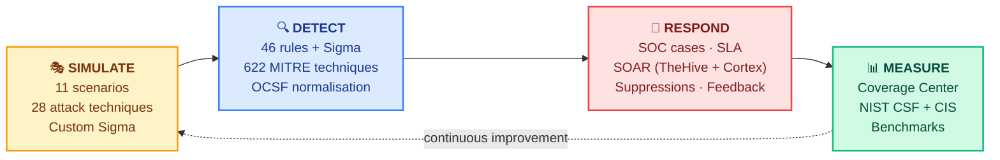

It answers, in concrete numbers — not bullet points — questions every CISO and detection engineer eventually asks:

| Question | Where the answer lives |
|----------|------------------------|
| *Of the 622 published ATT&CK techniques, which can my SOC actually detect today?* | **Detection Coverage Center** — 8 honest states (Validated / Failed / Untested / Rule-only / Not-covered / …) |
| *What's the false-positive rate of my detection rules in the last 30 days?* | **SOC Workflow** — analyst feedback loop on every alert |
| *If a Solorigate-style supply-chain attack hits us today, will we catch it before exfiltration?* | Run `scenario apt_campaign` and read the report |
| *Are my log sources sufficient for detecting credential dumping?* | `required_logs` per technique × `available_logs` per host group |
| *How fast can analysts triage? What's the SLA breach rate?* | SOC cases store SLA, status transitions and time-to-close |
| *Which detection-engineer change broke detection?* | Versioned rule store + benchmark comparison |

---

## 📊 Project at a glance

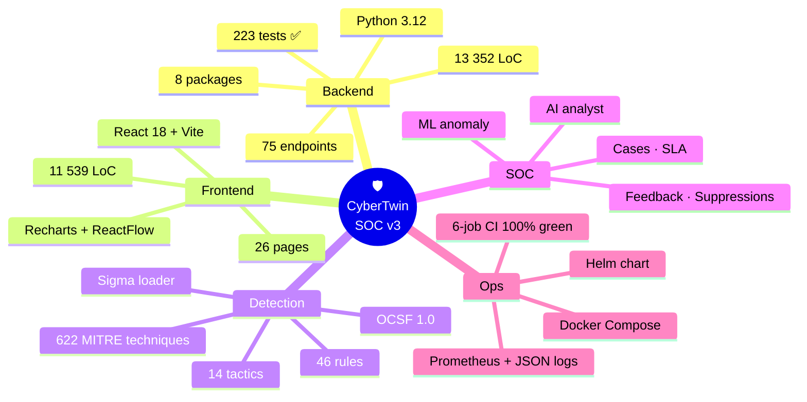

| Metric                              |   Count | Notes                                                                     |
|-------------------------------------|--------:|---------------------------------------------------------------------------|
| **Backend Python**                  |  13 352 | 8 packages — `api`, `detection`, `coverage`, `soc`, `ingestion`, `mitre`… |
| **Frontend React/JSX**              |  11 539 | 26 pages, 10 reusable components, Recharts visualisations                 |
| **Unit & integration tests**        |     223 | All passing on `pytest tests/` (~30 s)                                    |
| **REST + WebSocket endpoints**      |      75 | Rate-limited, RBAC-scoped, OpenAPI-documented                             |
| **MITRE ATT&CK techniques**         |     622 | Full Enterprise matrix · 14 tactics · TAXII 2.1 sync                      |
| **Built-in detection rules**        |      46 | 14 platforms · severity-tiered · runtime Sigma upload                    |
| **Attack scenarios**                |      11 | Solorigate, ProxyShell, Log4Shell, Insider, Ransomware, …                |
| **RBAC roles**                      |      12 | 3 legacy + 9 enterprise (tier1 / senior / manager / hunter / auditor / …) |
| **Connectors (extensible)**         |      15 | 5 deterministic mocks + 10 real-system stubs (Splunk, Sentinel, …)        |
| **Known CVEs in dependencies**      |       0 | Verified by `pip-audit --strict` and `npm audit`                          |
| **Database indexes (audited)**      |    7/7 ✅ | `scripts/check_db_indexes.py` — 0 missing across 7 tables                 |

---

## ✅ Validation status

> **Honesty rule** — every claim in this README has a corresponding artefact in [`docs/proof/`](docs/proof/). When a number changes, both the README and the proof file are updated in the same commit.

| Area                      | Status                                                | Evidence |
|---------------------------|-------------------------------------------------------|----------|
| **Backend tests**         | ✅ 223 / 223 passing                                   | [`docs/proof/coverage-report.md`](docs/proof/coverage-report.md) |
| **Frontend build**        | ✅ Passing                                             | GitHub Actions `Frontend Build` job |
| **Docker build**          | ✅ Retry-loop healthcheck on `/api/health` & `/health` | [`docs/proof/docker-validation.md`](docs/proof/docker-validation.md) |
| **Helm chart**            | ✅ Lint + render in CI                                 | `helm-lint` job + uploaded `helm-rendered-{sha}` artefact |
| **Compose profiles**      | ✅ default + `soar`                                    | [`docs/proof/docker-validation.md`](docs/proof/docker-validation.md) |
| **Code quality**          | ✅ flake8 = 0 errors                                   | `Code Quality` CI job |
| **Security gates**        | ✅ `pip-audit`, `npm audit`, `gitleaks` — **blocking** | [`docs/proof/security-scan-summary.md`](docs/proof/security-scan-summary.md) |
| **Known CVEs**            | ✅ **0**                                               | [`docs/proof/security-scan-summary.md`](docs/proof/security-scan-summary.md) |
| **Database indexes**      | ✅ 7/7 tables, 0 missing                               | [`docs/proof/database-indexing-report.md`](docs/proof/database-indexing-report.md) |
| **MITRE coverage**        | 📊 **40 / 622** rule-mapped (6.43 %) — honest         | [`docs/proof/mitre-coverage-snapshot.md`](docs/proof/mitre-coverage-snapshot.md) |
| **Pipeline benchmarks**   | 📊 3 scenarios × 3 runs · 4–13 s end-to-end           | [`docs/proof/benchmark-results.md`](docs/proof/benchmark-results.md) |
| **Audit report (deep)**   | 📋 7 domains scored · 4 critical issues fixed         | [`docs/proof/audit-report.md`](docs/proof/audit-report.md) |

Legend: ✅ green, continuously enforced · 📊 measured snapshot · 📋 narrative report · ⏳ work in progress.

---

## 🏗 Architecture

### High-level component diagram

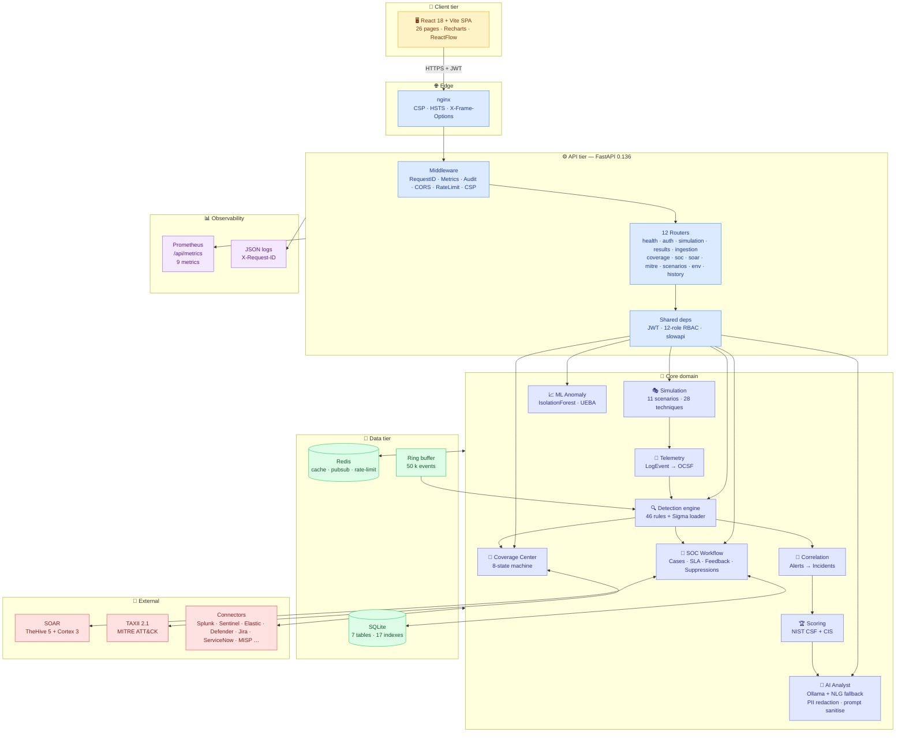

### End-to-end simulation pipeline

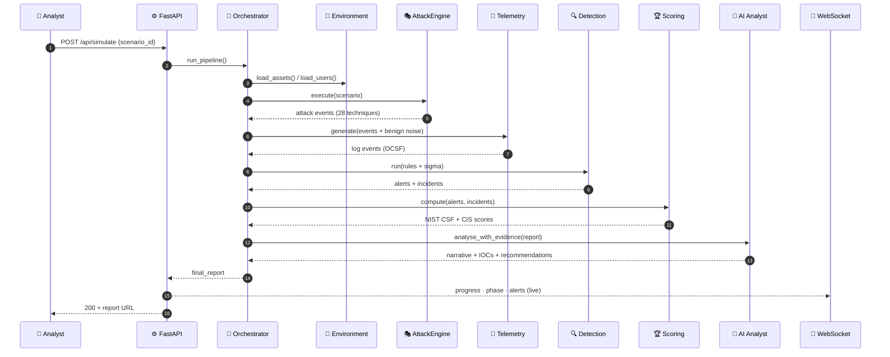

### Live SOC ingestion (OCSF)

```mermaid
flowchart LR
    subgraph Sources["🛰 Sources"]
        W["Windows EventLog<br/>4624 · 4625 · 4688 · …"]
        S["Sysmon<br/>1 · 3 · 7 · 8 · …"]
        SY["Syslog 3164 / 5424"]
        CT["AWS CloudTrail"]
        JS["Generic JSON"]
    end

    subgraph Norm["🔄 Normaliser"]
        M["mappers.py<br/>→ OCSF 1.0"]
    end

    subgraph Ingest["📥 Ingestion API · 9 endpoints"]
        E1["/event"]
        E2["/batch ≤ 5000"]
        E3["/syslog"]
        E4["/upload NDJSON ≤ 25 MB"]
        E5["/detect"]
    end

    subgraph Buf["💾 Ring buffer"]
        B["50 000 events<br/>thread-safe<br/>per-source"]
    end

    subgraph Det["🧠 Same Detection brain"]
        R["46 rules + Sigma uploads"]
    end

    Sources --> Norm --> Ingest --> Buf --> Det
    Det -->|alerts| SOC["🚨 SOC Workflow"]
    Det -->|metrics| Prom["📊 Prometheus"]

    classDef src fill:#fef3c7,stroke:#f59e0b
    classDef nrm fill:#dbeafe,stroke:#3b82f6
    classDef ing fill:#e0e7ff,stroke:#6366f1
    classDef buf fill:#dcfce7,stroke:#22c55e
    classDef det fill:#fee2e2,stroke:#ef4444

    class W,S,SY,CT,JS src
    class M nrm
    class E1,E2,E3,E4,E5 ing
    class B buf
    class R det
```

---

## 🚀 Features

### 🎭 Adversary simulation engine
- **11 turn-key scenarios** — Solorigate, ProxyShell, Log4Shell, Insider, Lateral movement, Cryptominer, Watering Hole, Living-off-the-Land, Ransomware, Cloud Attack, DDoS Infrastructure
- **28 baked-in attack techniques** with MITRE ATT&CK ID on every event
- **Path-traversal-proof scenario builder** with strict id validation
- **Realistic timeline generator** that interleaves benign user activity with adversarial actions

### 🔍 Multi-source detection engine
- **46 built-in rules** — Windows EID, Sysmon, Linux audit, web access, DNS, network, AWS CloudTrail, Azure activity, Office 365
- **Sigma loader** — upload `*.yml` rules at runtime, **ReDoS-hardened** (`re.escape` + `fullmatch`, 256 KB body cap)
- **Severity tiering** + confidence weighting + tactic-diversity bonus
- **Incident correlation** — alerts → incidents (kill-chain phase aggregation, multi-host pivot detection)

### 🎯 MITRE ATT&CK Coverage Center *(honest, not vapourware)*

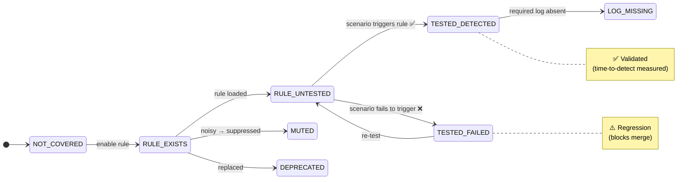

8 honest states (`NOT_COVERED`, `RULE_EXISTS`, `RULE_UNTESTED`, `TESTED_DETECTED`, `TESTED_FAILED`, `LOG_MISSING`, `MUTED`, `DEPRECATED`) with **time-to-detect**, **severity-weighted confidence**, and **per-tactic risk score** weighted toward Initial Access, Privilege Escalation and Exfiltration.

### 🤖 AI Analyst (LLM + deterministic fallback)
- Ollama-compatible (Llama 3, Mistral, Qwen) with automatic fallback to a **fully deterministic NLG template**, so reports are always produced
- **Evidence-first** narrative — every claim grounded on an alert ID or log timestamp
- **Prompt-injection hardened** — `_sanitise()` redacts AWS/GCP/JWT/PEM keys, emails, passwords, credit cards, neutralises injection markers, hard-caps the prompt at 32 KB
- IOC extractor — external/internal IPs, domains, URLs, **MD5/SHA1/SHA256 hashes**, **emails**, compromised accounts

### 📈 ML anomaly detection & UEBA
- IsolationForest baseline trained on benign telemetry
- Per-user behavioural drift score
- Configurable contamination rate; warm-start on retrain

### 🚨 SOC workflow (alerts → cases → SLA)

```mermaid
flowchart LR
    AL[("🛎 Alert")] --> CA{Case<br/>auto/manual}
    CA -->|new| NEW["📝 NEW"]
    NEW -->|assign| IP["🛠 IN_PROGRESS"]
    IP -->|resolved| RES["✅ RESOLVED"]
    IP -->|false-positive| FP["🟡 FALSE_POSITIVE"]
    RES -->|verify| CL["🔒 CLOSED"]
    FP -->|verify| CL

    IP -. comment / evidence .-> IP
    IP -. SLA timer · severity → hours .-> IP
    FP -- updates rule confidence --> RULE["📊 Rule confidence"]
    FP -- suggests --> SUP["🤫 Suppression w/ TTL"]

    classDef state fill:#dbeafe,stroke:#3b82f6
    classDef end fill:#dcfce7,stroke:#22c55e
    classDef fp fill:#fef3c7,stroke:#f59e0b
    class NEW,IP state
    class RES,CL end
    class FP fp
```

- SQLite-backed case store · status transitions · comments · evidence attachments · SLA hours per severity
- Analyst feedback (`true_positive` / `false_positive`) feeds back into rule confidence
- Scoped suppressions with TTL to silence known-noisy rules per host/user
- **SQL-injection-hardened** UPDATE composer (column allowlist + identifier regex, double-belt defence)

### 🤝 SOAR integration
- Optional `--profile soar` in docker-compose
- **TheHive 5** — auto-create cases, attach observables
- **Cortex 3** — run analyzers, enrich IOCs
- Bidirectional webhook in/out

### 🧪 Compliance benchmarking
- Maps every detection capability to **NIST CSF v1.1** sub-categories (`DE.AE-2`, `DE.CM-7`, …) and **CIS Controls v8** (CIS 8.11, CIS 13.6, …)
- Generates a compliance score per simulation
- Trend dashboard for posture improvement

### 🏷 Enterprise RBAC (12 roles)

| Tier            | Roles |
|-----------------|-------|
| **Legacy**      | `admin` · `analyst` · `viewer` |
| **Tier-1 ops**  | `tier1_analyst` · `senior_analyst` · `soc_manager` |
| **Engineering** | `detection_engineer` · `threat_hunter` |
| **Read-only**   | `auditor` · `read_executive` · `service_account` |
| **Platform**    | `platform_admin` |

Permissions are **scoped** (`case:write`, `rule:disable`, `ingestion:read`, `audit:export`, …) — never blanket admin.

### 🔌 Connector framework

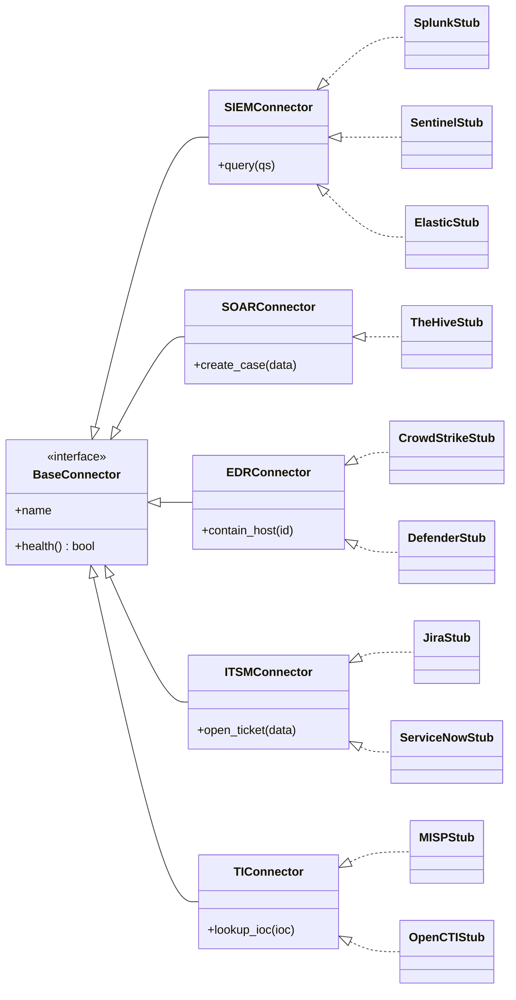

---

## ⚡ Quick start

### Option A — Docker Compose (recommended)

```bash
git clone https://github.com/omarbabba779xx/CyberTwin-SOC.git
cd CyberTwin-SOC

# Set strong secrets BEFORE first run
cp .env.example .env
# edit .env: set JWT_SECRET (>= 32 chars) + AUTH_*_PASSWORD

docker compose up -d
```

| Service        | URL                                         | Notes                           |
|----------------|---------------------------------------------|---------------------------------|
| Frontend       | <http://localhost>                          | nginx-unprivileged, port 80→8080 |
| API + OpenAPI  | <http://localhost:8000/docs>                |                                 |
| Prometheus     | <http://localhost:8000/api/metrics>         | restrict via `RESTRICT_INTERNAL_ENDPOINTS=true` |
| Health (deep)  | <http://localhost:8000/api/health/deep>     | restrict via env var in prod    |

### Option B — Local development

```bash
# Backend
python -m venv .venv && .venv/Scripts/Activate.ps1   # Windows
pip install -r requirements.txt
uvicorn backend.api.main:app --reload --port 8000

# Frontend
cd frontend && npm ci && npm run dev    # http://localhost:3001
```

### Option C — Kubernetes via Helm

```bash
helm install cybertwin deploy/helm/cybertwin-soc \
  --set ingress.host=soc.example.com \
  --set serviceMonitor.enabled=true \
  --create-namespace -n cybertwin
```

`runAsNonRoot`, `drop:[ALL]`, liveness/readiness/startup probes, and a `ServiceMonitor` for `kube-prometheus-stack` are all pre-wired.

---

## 📥 Live telemetry ingestion (OCSF)

### Single Windows logon event

```bash
curl -X POST http://localhost:8000/api/ingest/event \
  -H "Authorization: Bearer $TOKEN" \
  -H "Content-Type: application/json" \
  -d '{
        "source": "windows_security",
        "event_id": 4625,
        "host": "WIN-DC-01",
        "user": "alice",
        "src_ip": "203.0.113.45",
        "raw": "..."
      }'
```

### NDJSON bulk upload (≤ 25 MB)

```bash
curl -X POST http://localhost:8000/api/ingest/upload \
  -H "Authorization: Bearer $TOKEN" \
  -H "Content-Type: application/x-ndjson" \
  --data-binary @sample.ndjson
```

### Run detection over the in-memory ring buffer

```bash
curl -X POST http://localhost:8000/api/ingest/detect -H "Authorization: Bearer $TOKEN"
```

> **One detection brain** — the ingestion path reuses the **same** 46 rules + every Sigma rule uploaded at runtime. Zero duplication between simulation and live detection.

**Hardening shipped (Apr 2026 audit)**: per-event 64 KB cap · syslog 5 000 lines × 8 KB cap · `_approx_size()` total guard · 600 req/min single, 60 req/min batch.

---

## 🎯 Detection Coverage Center

```bash
curl http://localhost:8000/api/coverage \
  -H "Authorization: Bearer $TOKEN" | jq '.summary'
```

```json
{
  "catalog_total": 622,
  "validated": 0,
  "untested": 40,
  "rule_mapped": 40,
  "not_covered": 582,
  "high_risk_gaps": 293,
  "rule_mapped_pct": 6.43
}
```

> The number of validated techniques is conservative on purpose: **a rule is validated only when a scenario exercises the technique AND the rule fires.** This is the number a CISO actually wants — not the catalogue size with optimistic mapping.

Latest snapshot: [`docs/proof/mitre-coverage-snapshot.md`](docs/proof/mitre-coverage-snapshot.md)

---

## 🎫 SOC workflow

| Method  | Path                                | Purpose                                       |
|--------:|-------------------------------------|-----------------------------------------------|
| `POST`  | `/api/cases`                        | Open a case from an alert                     |
| `GET`   | `/api/cases`                        | List with filters & SLA status                |
| `PATCH` | `/api/cases/{id}`                   | Update status/assignee (allowlist-validated) |
| `POST`  | `/api/cases/{id}/comment`           | Append a comment                              |
| `POST`  | `/api/cases/{id}/evidence`          | Attach evidence artefact                      |
| `POST`  | `/api/feedback/{alert_id}`          | TP / FP feedback for a rule                   |
| `POST`  | `/api/suppressions`                 | Add scoped suppression with TTL               |

---

## 📊 Observability & metrics

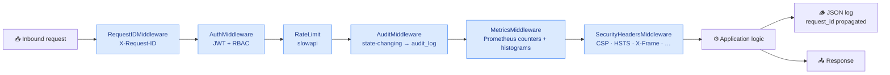

```promql
# p95 API latency per endpoint
histogram_quantile(0.95,
  sum by (path,le)(rate(cybertwin_request_latency_seconds_bucket[5m])))

# ingestion EPS by source
sum by (source)(rate(cybertwin_ingest_events_total[1m]))

# rolling FP rate per rule
sum by (rule_id)(rate(cybertwin_feedback_total{verdict="false_positive"}[24h]))
  / sum by (rule_id)(rate(cybertwin_feedback_total[24h]))
```

---

## 🔐 Security posture

| Surface         | Control                                                                                              |
|-----------------|------------------------------------------------------------------------------------------------------|
| Auth            | bcrypt (12 rounds) · JWT HS256 (64-char key in prod) · jti denylist · refresh token rotation         |
| Tokens          | 1h access token (default) · 7d refresh token · `POST /api/auth/logout` revokes via Redis denylist   |
| API             | slowapi rate-limit on every endpoint · CORS strict methods+headers · 12-role scoped RBAC             |
| HTTP headers    | `SecurityHeadersMiddleware` (backend) + `nginx.conf` (frontend) — CSP · HSTS · X-Frame              |
| File uploads    | `_safe_path()` regex + path-resolution check — no traversal possible                                 |
| Sigma loader    | YAML safe_load · 256 KB max · ReDoS-proof globbing · `re.fullmatch`                                  |
| SQL             | Parametrised queries · column allowlist + regex for dynamic `UPDATE`                                 |
| LLM             | `_sanitise()` redacts PII/keys · prompt-injection markers neutralised · 32 KB hard cap              |
| Ingestion       | `ingestion:write` scoped permission · per-event 64 KB · syslog 5 000 × 8 KB · `_approx_size()` guard |
| Secrets         | `.jwt_secret` git-ignored & untracked · env-driven · prod gate (refuses start if weak)              |
| Containers      | `nginx-unprivileged` (uid 101) · `runAsNonRoot` · `drop:[ALL]` · multi-stage builds                 |
| Audit           | Every state-changing endpoint logs to `audit_log` (user, role, IP, action, timestamp)               |
| DB indexes      | 7/7 tables, 0 missing — `scripts/check_db_indexes.py` · 17 PostgreSQL indexes in Alembic migration  |

### Continuous security checks

| Tool          | Scope                                          | Status |
|---------------|------------------------------------------------|:------:|
| **pip-audit** | Python dependency CVEs                         | ✅ **blocking** · 0 known CVE |
| **npm audit** | Frontend dependency CVEs (high+)               | ✅ **blocking** · 0 high |
| **Gitleaks**  | Secret scanning across full git history        | ✅ **blocking** · 0 leaks |
| **Bandit**    | Python static security analysis                | ⚠ non-blocking · 0 high |
| **Semgrep**   | Multi-language SAST                            | ⚠ non-blocking |
| **Trivy**     | Filesystem + container vuln scan               | ⚠ non-blocking |
| **CycloneDX** | SBOM (Python + npm)                            | 📦 artefact upload |

Full audit report (7 domains scored, 4 critical issues fixed): [`docs/proof/audit-report.md`](docs/proof/audit-report.md).

---

## 🔄 CI/CD pipeline

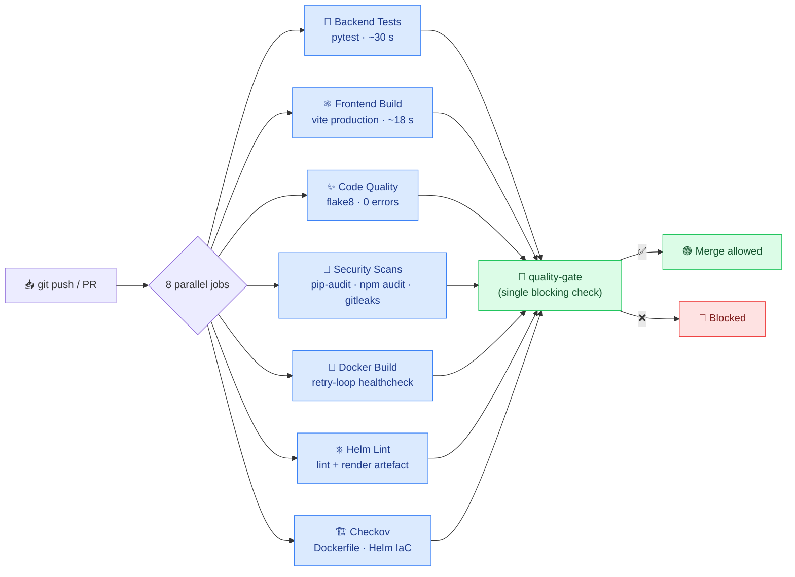

---

## 🚢 Production deployment

### Docker Compose

```bash
# Full SOC stack (incl. SOAR)
docker compose --profile soar up -d

# Just the SOC core
docker compose up -d
```

| Service     | Port (host→container) | Purpose                                          |
|-------------|----------------------:|--------------------------------------------------|
| `frontend`  | 80 → 8080             | nginx-unprivileged (uid 101) React SPA           |
| `backend`   | 8000                  | FastAPI uvicorn (uid 1000 non-root)              |
| `redis`     | 6379                  | cache · pubsub · rate-limiter · jti denylist     |
| `thehive`   | 9000                  | (`soar` profile only — demo, no auth)            |
| `cortex`    | 9001                  | (`soar` profile only — demo, no auth)            |

### Helm

```bash
helm upgrade --install cybertwin deploy/helm/cybertwin-soc \
  --set image.backend.tag=v3.0.0 \
  --set image.frontend.tag=v3.0.0 \
  --set ingress.host=soc.example.com \
  --set ingress.tls.enabled=true \
  --set serviceMonitor.enabled=true
```

### Load benchmarks

```bash
# k6 — API load test (p95 < 500 ms gate)
k6 run benchmarks/k6_api_test.js -e BASE=http://localhost:8000 -e TOKEN=$JWT

# Locust — ingestion throughput
locust -f benchmarks/locust_ingestion.py --host http://localhost:8000

# Pipeline — end-to-end timing
python -m benchmarks.bench_pipeline
```

---

## 📂 Project structure

```mermaid
flowchart TB
    ROOT["📁 CyberTwin-SOC"]
    ROOT --> BE["🐍 backend/<br/>13 352 LoC · Python 3.12"]
    ROOT --> FE["⚛️ frontend/<br/>11 539 LoC · React 18 + Vite"]
    ROOT --> TS["🧪 tests/<br/>223 tests · 100 % passing"]
    ROOT --> BM["📊 benchmarks/<br/>k6 · locust · pipeline · MITRE snapshot"]
    ROOT --> DEP["⎈ deploy/helm/<br/>chart + ServiceMonitor"]
    ROOT --> SC["📜 scenarios/<br/>11 attack JSON"]
    ROOT --> SCR["🔧 scripts/<br/>check_db_indexes.py"]
    ROOT --> DOC["📖 docs/<br/>IMPROVEMENTS · proof/"]
    ROOT --> CI["🔄 .github/workflows/<br/>ci.yml — 6 jobs"]

    BE --> BE1["api/ — routes + main.py + deps.py"]
    BE --> BE2["detection/ — 46 rules + Sigma loader + correlation"]
    BE --> BE3["coverage/ — 8-state machine + gap analyzer"]
    BE --> BE4["soc/ — cases · feedback · suppressions"]
    BE --> BE5["ingestion/ — OCSF ring buffer + pipeline"]
    BE --> BE6["mitre/ — 622 techniques · TAXII sync"]
    BE --> BE7["normalization/ — Win/Sysmon/syslog/CloudTrail"]
    BE --> BE8["observability/ — Prometheus · JSON logs · headers"]
    BE --> BE9["llm_analyst.py · ai_analyst.py · orchestrator.py"]
    BE --> BE10["connectors/ · scoring/ · simulation/ · reports/ · soar/ · telemetry/"]

    FE --> FE1["src/pages/ — 26 pages"]
    FE --> FE2["src/components/ — 10 reusable"]
    FE --> FE3["nginx.conf — CSP · HSTS · X-Frame"]

    classDef root fill:#fef3c7,stroke:#f59e0b
    classDef be fill:#dbeafe,stroke:#3b82f6
    classDef fe fill:#fee2e2,stroke:#ef4444
    classDef ops fill:#dcfce7,stroke:#22c55e

    class ROOT root
    class BE,BE1,BE2,BE3,BE4,BE5,BE6,BE7,BE8,BE9,BE10 be
    class FE,FE1,FE2,FE3 fe
    class TS,BM,DEP,SC,SCR,DOC,CI ops
```

---

## 🧪 Quality & testing

```bash
# Full suite
python -m pytest tests/ -v

# With coverage
python -m pytest tests/ --cov=backend --cov-report=term-missing

# CI-equivalent lint
flake8 backend/ --max-line-length=120 --ignore=E501,W503,E402,E241,E231,E704

# Local security scans
bandit -r backend/ -ll --skip B101,B104
pip-audit -r requirements.txt --strict

# DB index audit (CI regression gate)
python -m scripts.check_db_indexes
```

Current `master`:

```
============================ 223 passed in 30.94s ============================
flake8: 0 errors · pip-audit: 0 CVE · npm audit: 0 high · gitleaks: 0 leaks
db indexes: 7/7 tables · 0 missing
```

---

## 📚 Documentation

| Document | Purpose |
|----------|---------|
| [`docs/proof/audit-report.md`](docs/proof/audit-report.md)                                 | Senior architect audit · 7 domains scored · 4 critical fixes |
| [`docs/proof/coverage-report.md`](docs/proof/coverage-report.md)                           | Pytest summary · code-path coverage |
| [`docs/proof/database-indexing-report.md`](docs/proof/database-indexing-report.md)         | DB index audit · 7 tables · 0 missing |
| [`docs/proof/mitre-coverage-snapshot.md`](docs/proof/mitre-coverage-snapshot.md)           | Honest 6.43 % rule-mapped snapshot |
| [`docs/proof/security-scan-summary.md`](docs/proof/security-scan-summary.md)               | pip-audit / Bandit / Gitleaks / Trivy / npm audit |
| [`docs/proof/benchmark-results.md`](docs/proof/benchmark-results.md)                       | Pipeline EPS · latency |
| [`docs/proof/docker-validation.md`](docs/proof/docker-validation.md)                       | Compose + Docker build proof |
| [`docs/IMPROVEMENTS.md`](docs/IMPROVEMENTS.md)                                             | 30-item backlog (next sprints) |
| [`CHANGELOG.md`](CHANGELOG.md)                                                             | Versioned change log |
| [`SECURITY.md`](SECURITY.md)                                                               | Vulnerability disclosure policy |
| [`CONTRIBUTING.md`](CONTRIBUTING.md)                                                       | How to contribute |
| [`CODE_OF_CONDUCT.md`](CODE_OF_CONDUCT.md)                                                 | Community standards |

---

## 🗺 Roadmap

> ✅ All 17 phases below are *delivered* on `master`.

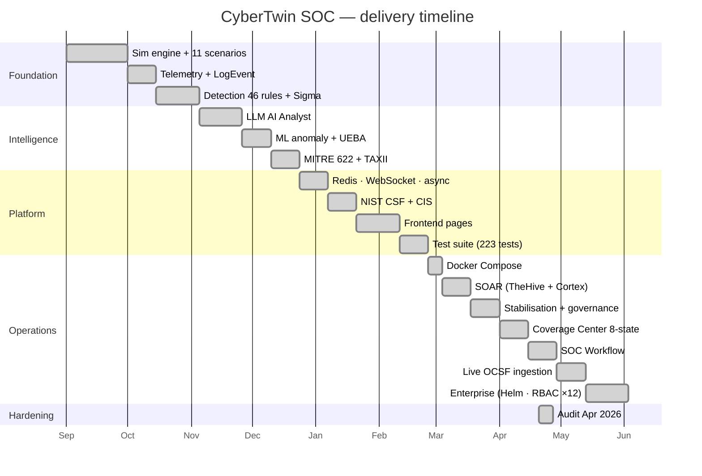

### Next ideas (not yet on `master`)

See [`docs/IMPROVEMENTS.md`](docs/IMPROVEMENTS.md) — 30-item backlog covering **multi-tenancy**, **real connectors (Splunk/Sentinel/Jira live)**, **executive dashboard**, **purple-team workflows**, **STIX/TAXII feed publishing**, **eBPF live agent**, **JA3/JA3S TLS fingerprinting**, **detection-as-code GitOps**, **SSO/OIDC**, **SOC 2 audit-log immutability**…

---

## 🤝 Contributing & license

PRs welcome. The bar is:

1. `pytest tests/` is green (223 / 223).
2. `flake8` is clean with the same flags CI uses.
3. New endpoints get a unit test **and** a permission scope.
4. New ATT&CK techniques get added to `backend/mitre/attack_data.py`.
5. No secrets, no hard-coded credentials, no path-traversal-prone string ops.
6. Security scans (`pip-audit`, `npm audit`, `gitleaks`) stay green — they are blocking.

Read [`CONTRIBUTING.md`](CONTRIBUTING.md) and [`CODE_OF_CONDUCT.md`](CODE_OF_CONDUCT.md) before opening a PR.

**License**: MIT — see [`LICENSE`](LICENSE).

---

<div align="center">

**Built with ❤️ for the cybersecurity community.**

If this project saves your team a sprint, **[⭐ star the repo](https://github.com/omarbabba779xx/CyberTwin-SOC)** — it's the only metric I track.

</div>
